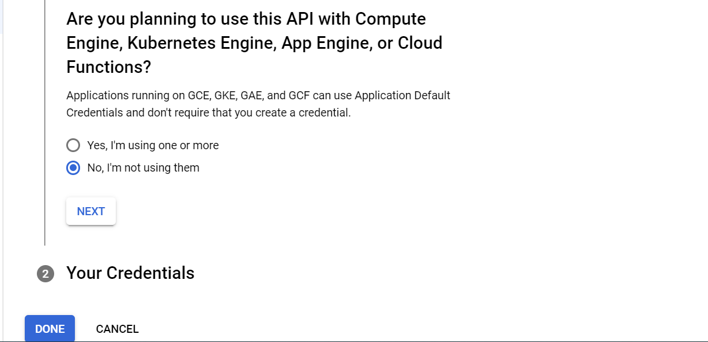

# -ImportGSheetsAPI
Таблица выгрузки заказов из Google Sheets и отображении ее на сайте в режиме реального времени.
-------------------------------------------------------------------------------------------------------------

Для функционирования выгрузки из GoogleSheetsAPI необходимо:
1. Создать личный проект на https://console.cloud.google.com/.

    Открываем панель выбора проекта
    

    Переходим в создание нового проекта
    

    Присвойте ему произвольное имя и нажмите кнопку Create
    

    Для выбор проекта, выберите созданный проект из списка проектов и нажмите на кнопку Open. Данный проект
    будет выбран и его название также будет отображаться на главной странице Google Cloud Platform
    
    

2. Подключить для него 2 API: Google Drive API и Google Sheets API

    В навигационном меню выбираем "APIs & Services" -> "Enabled APIs & Services"
    

    В поиске вводим название необходимого API. В выпадающем списке выбираем соответствующее API из группы "Marketplace".
    

    Нажимаем кнопку Enable.
    

    Повторяем аналогичные действия для второго из перечисленных API.

3. Создать учетные данные для Google Drive API с ролью Проект-Редактор. 

    В навигационном меню выбираем "APIs & Services" -> "Enabled APIs & Services"
    

    В нижней части окна, в списке API проекта, выбираем ранее добавленный Google Drive API
    

    Выбираем "CREATE CREDENTIALS"
    

    Выбираем:
     - "Select an API" ---> "Google Drive API";
     - "What data will you be accessing?" ---> "Application data";
     - "Are you planning to use this API with Compute Engine, Kubernetes Engine, 
     App Engine, or Cloud Functions?" ---> "No, i'm not using them";

     Нажимаем на кнопку "Next"
     
     

    Заполняем: 
    - "Service account name" ---> "account"
    Нажимаем "Create and continue"
    

    Выбираем:
        Role: Project --> Editor
    Нажимаем "Continue"
    Нажимаем "Done"
    

4. Создать и выгрузить json-ключ аккаунта.

    В навигационном меню выбираем "APIs & Services" -> "Credentials"
    

    В панели "Service Accounts" выбираем наш аккунт.
    

    Во вкладке "Keys", выбираем "Add key" --> "Create new key"
    

    В появившемся окне выбираем "Json" и нажимаем кнопку "Create"
    

    Ключ сформируется,а так же произойдет скачивание файла с ключом на Ваш ПК.

4. Полученный файл поместить в папку ./backend/g_sheets/ данного проекта и переименовать в creds.json. (Внимание!!! ДАнный ключ содержит конфиденциальные данные, ни в коем случае не передавайте их сторонним лицам.)

5. Сгенерированный при создании учетных данных email добавить в пользователи отслеживаемой таблицы.

-------------------------------------------------------------------------------------------------------------
Используемая при создании таблица:
https://docs.google.com/spreadsheets/d/1AZ44qofs3jX3WjIRVVQq9uAwZVd7N6voFKnq-6aNbSU/edit#gid=0

Для создания своей таблицы рекоммендуется:
 - создать таблицу;
 - скопировать данные;
 - добавить сформированный в предыдущих пунктах аккаунт в редакторы таблицы;
 - В файле проекта ./backend/g_sheets/run.py изменнить значение переменной sheet_id, добавив аналогичный фрагмент адреса своей таблицы:

-------------------------------------------------------------------------------------------------------------
Текущий проект расчитан на получение максимум 5000 записей. В случае превышения данного лимита, необходимо в файле ./backend/g_sheets/run.py изменить диапазон в переменной "range" (пример: "A1:D10000")

-------------------------------------------------------------------------------------------------------------